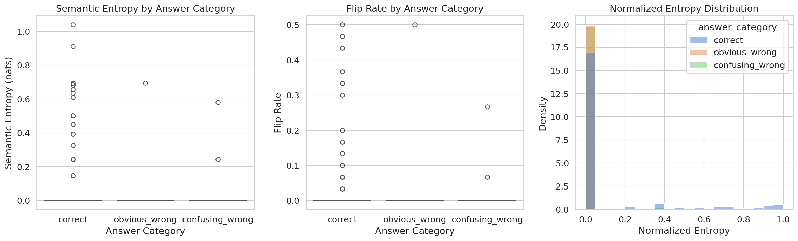
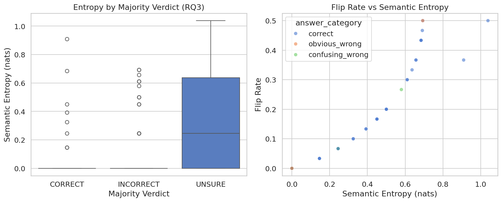
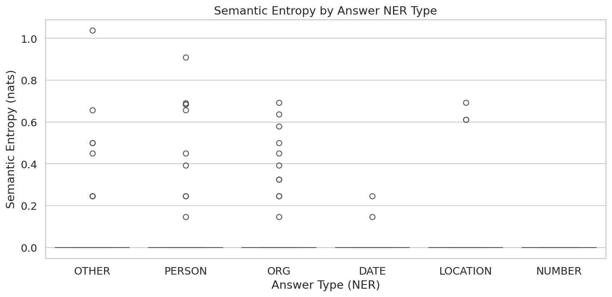

# LLM-Judge Semantic Uncertainty: Phase A Baseline 실험 보고서

> **프로젝트**: LLM Reward Consistency Framework for Offline Reinforcement Learning  
> **실험 단계**: Phase A — Baseline (Pseudo-Deterministic Setting)  
> **실험 기간**: 2025.02.15 ~ 2025.02.18  
> **실험자**: 이정우 (고려대학교 SW-AI 융합대학원)

---

## 1. 연구 배경 및 목적

### 1.1 문제 정의

LLM-as-a-Judge 시스템은 LLM의 출력을 평가하는 데 널리 사용되지만, 동일한 입력에 대해 반복 평가 시 **판단이 일관되지 않는 문제**가 존재한다. 이러한 불안정성은 Offline RL에서 reward signal로 활용될 때 학습 품질을 직접적으로 저하시킨다.

### 1.2 연구 질문

| ID | 연구 질문 | Phase |
|----|----------|-------|
| RQ1 | 결정론적 설정(T=0, seed 고정)에서도 판단 불안정성이 나타나는가? | A (본 실험) |
| RQ2 | 어떤 프롬프트 perturbation이 가장 큰 semantic entropy 증가를 유발하는가? | B (다음 단계) |
| RQ3 | 높은 semantic entropy는 높은 판단 오류율과 연관되는가? | A (본 실험) |

### 1.3 핵심 가설

> **H₀**: T=0, seed=42 설정에서 GPT-4o-mini Judge의 판단은 완벽하게 결정론적이다.  
> **H₁**: Pseudo-deterministic 설정에서도 API의 hidden randomness로 인해 일부 문항에서 판단이 흔들린다.

---

## 2. 실험 설계

### 2.1 데이터셋

- **소스**: TriviaQA (rc subset, validation split) — HuggingFace Datasets
- **규모**: 17,927개 중 200문항 랜덤 샘플링 (seed=42)
- **필터링**: context 길이 50~2,000 단어

### 2.2 Answer Type 분류 (spaCy NER)

질문-정답 쌍에 대해 `en_core_web_sm` 모델로 NER 분류를 수행하였다. 질문 맥락을 함께 제공하여 단독 정답 텍스트보다 높은 인식률을 달성하였다.

| Answer Type | 문항 수 | 비율 |
|------------|---------|------|
| ORG | 61 | 30.5% |
| PERSON | 55 | 27.5% |
| OTHER | 36 | 18.0% |
| LOCATION | 36 | 18.0% |
| DATE | 7 | 3.5% |
| NUMBER | 5 | 2.5% |

### 2.3 오답 생성 (Rule-Based)

각 문항에 대해 3가지 answer category를 구성하였다:

| Category | 생성 방법 | 예시 |
|----------|----------|------|
| `correct` | 원본 정답 | Al Capone |
| `obvious_wrong` | Cross-Type Entity Swap (다른 NER 타입의 정답) | Prince Edward Island (LOCATION → PERSON 문항) |
| `confusing_wrong` | Same-Type Entity Swap 또는 Numeric Perturbation | Jacob Epstein (PERSON → PERSON) |

### 2.4 Judge 설정

| 항목 | 설정값 |
|------|--------|
| 모델 | GPT-4o-mini |
| Temperature | 0.0 |
| Seed | 42 |
| 반복 횟수 | 30회/문항 |
| Logprobs | 활성화 (top 5) |
| Max Tokens | 300 |
| 응답 형식 | 구조화된 JSON (verdict, evidence_span, brief_rationale) |

### 2.5 평가 규모

| 항목 | 수치 |
|------|------|
| 문항 수 | 200 |
| Answer Category | 3 (correct, obvious_wrong, confusing_wrong) |
| Evaluation Set | 600 (200 × 3) |
| 반복 횟수 | 30 |
| **총 API 호출** | **18,000** |

### 2.6 측정 지표

**Semantic Entropy (SE)**

$$H = -\sum_{i} p_i \ln(p_i) \quad (p_i > 0)$$

verdict 분포(CORRECT, INCORRECT, UNSURE)를 클러스터로 사용하는 Simple Clustering 방식이다. 모든 판정이 동일하면 H=0(완벽한 안정), 판정이 분산될수록 H가 증가한다.

**Normalized Semantic Entropy**

$$H_{norm} = \frac{H}{\ln(K)} \quad (K = \text{활성 클러스터 수})$$

0~1 범위로 정규화하여 문항 간 비교를 가능하게 한다.

**Flip Rate**

$$\text{Flip Rate} = \frac{N - N_{majority}}{N}$$

30회 반복 중 다수결과 다른 판정의 비율이다. Entropy보다 직관적인 불안정성 지표이다.

---

## 3. 구현

### 3.1 프로젝트 구조

```
llm-judge-uncertainty/
├── configs/experiment.yaml          # 실험 하이퍼파라미터 (단일 설정 파일)
├── src/
│   ├── prepare_data.py             # Step 1: TriviaQA 로드 + NER 분류 + 오답 생성
│   ├── run_judge.py                # Step 2a: 실시간 async API 호출 (rate limit 이슈)
│   ├── run_judge_batch.py          # Step 2b: OpenAI Batch API (최종 사용)
│   ├── analyze.py                  # Step 3: Entropy 계산 + 통계 검정 + 시각화
│   └── utils.py                    # 공통 유틸리티 (config, logging, JSONL I/O)
├── data/processed/
│   ├── questions.jsonl             # 200 문항 + NER 타입 + 오답
│   └── evaluation_set.jsonl        # 600 평가 세트 (200 × 3)
├── results/
│   ├── logs/judge_results.jsonl    # 18,000건 Judge 응답 로그
│   └── analysis/                   # CSV, JSON, PNG 결과물
├── tests/test_smoke.py
├── .vscode/                        # VSCode 프로젝트 설정
├── requirements.txt
├── setup.sh                        # 원클릭 환경 설정
└── Makefile
```

### 3.2 실행 파이프라인

```bash
# 환경 설정
bash setup.sh

# Step 1: 데이터 준비 (200문항, 600 eval sets)
python -m src.prepare_data

# Step 2: Judge 반복 샘플링 (18,000 API calls via Batch API)
python -m src.run_judge_batch auto

# Step 3: 분석
python -m src.analyze
```

### 3.3 주요 구현 사항

**데이터 준비 (`prepare_data.py`)**
- HuggingFace `trivia_qa/rc` 데이터셋에서 validation split 로드
- spaCy NER 분류 시 질문 맥락 포함으로 인식률 향상 (예: "Prince Edward Island"가 OTHER → LOCATION으로 정확 분류)
- Same-Type 풀이 비어있을 때 전체 풀 fallback으로 confusing_wrong 생성 보장

**Judge 실행 (`run_judge_batch.py`)**
- OpenAI Batch API 사용으로 rate limit 문제 해소 및 비용 50% 절감
- Enqueued token limit(2M) 대응을 위한 자동 분할: 200건/배치 × 90 파트
- 배치 간 90초 쿨다운 + 실패 시 180초 대기 후 자동 재제출
- Resume 지원: 중단 시 완료된 파트를 건너뛰고 이어서 실행

**분석 (`analyze.py`)**
- Verdict 분포 집계 → Semantic Entropy → Normalized SE → Flip Rate 계산
- Kruskal-Wallis (entropy vs answer_category), Mann-Whitney U (entropy vs correctness) 통계 검정
- 3종 시각화 자동 생성

### 3.4 실행 이력 및 이슈

| 날짜 | 이벤트 | 해결 |
|------|--------|------|
| 02.15 | `from __future__` SyntaxError | import를 docstring 위로 이동 |
| 02.15 | spaCy NER에서 OTHER 과잉 분류 (60%) | 질문 맥락 포함 NER로 18%로 개선 |
| 02.15 | `run_judge.py` RPM rate limit 경고 | exponential backoff 자동 재시도 |
| 02.15 | RPD 10,000/day 한도 도달 → API_ERROR 발생 | `get_completed_keys()`에서 에러 건 제외하여 resume 시 재시도 |
| 02.15 | Batch API 파일 크기 209MB > 200MB 한도 | 자동 분할 로직 추가 |
| 02.15 | Enqueued token limit 2M 도달 | 배치 크기 600→200건 축소 + 쿨다운/자동 재시도 |
| 02.18 | 전체 18,000건 Batch 완료 | — |

### 3.5 비용

| 항목 | 수치 |
|------|------|
| Prompt Tokens | 약 52M |
| Completion Tokens | 약 1.4M |
| 단가 (Batch 50% 할인) | Input $0.075/1M, Output $0.30/1M |
| **총 비용** | **~$3.92** |

---

## 4. 실험 결과

### 4.1 전체 요약

| 지표 | 값 |
|------|-----|
| 총 Evaluation Sets | 600 |
| 총 API 호출 | 18,000 |
| 불안정 세트 (flip_rate > 0) | **35 / 600 (5.8%)** |
| 평균 Semantic Entropy | 0.0275 nats |
| 최대 Semantic Entropy | 1.0386 nats |
| 평균 Flip Rate | 0.0129 |

### 4.2 Verdict 분포

| Verdict | 건수 | 비율 |
|---------|------|------|
| CORRECT | 3,964 | 22.0% |
| INCORRECT | 13,420 | 74.6% |
| UNSURE | 616 | 3.4% |

Majority Verdict 기준:

| Majority Verdict | Eval Sets |
|-----------------|-----------|
| INCORRECT | 447 (74.5%) |
| CORRECT | 132 (22.0%) |
| UNSURE | 21 (3.5%) |

**주목할 점**: 정답(correct) 200 세트 중 majority verdict가 CORRECT인 경우는 131건(65.5%)에 불과하다. 50건(25%)은 INCORRECT, 19건(9.5%)은 UNSURE로 다수결 판정되었다. 이는 Judge가 정답임에도 "틀렸다"거나 "판단 불가"로 판정하는 **false negative** 경향을 보여준다.

### 4.3 RQ1: Answer Category별 판단 안정성

| Category | 평균 SE | 최대 SE | 평균 Flip Rate | 불안정 세트 |
|----------|---------|---------|---------------|------------|
| **correct** | **0.0738** | **1.0386** | **0.0343** | **31 / 200 (15.5%)** |
| obvious_wrong | 0.0035 | 0.6931 | 0.0025 | 1 / 200 (0.5%) |
| confusing_wrong | 0.0053 | 0.5799 | 0.0020 | 3 / 200 (1.5%) |

**통계 검정 (Kruskal-Wallis)**:
- Entropy vs Answer Category: H=51.10, **p=8.03×10⁻¹²**
- Flip Rate vs Answer Category: H=51.07, **p=8.14×10⁻¹²**

**해석**: 판단 불안정성은 answer category 간에 극도로 유의미한 차이를 보인다 (p < 10⁻¹¹). 정답(correct) 카테고리가 오답 대비 entropy 15\~20배, flip rate 14\~17배 높다. **Judge는 오답을 "틀렸다"고 판단하는 데는 매우 안정적이나, 정답을 "맞다"고 확인하는 데서 판단이 흔들린다.**

### 4.4 RQ3: Entropy와 Correctness의 관계

**통계 검정 (Mann-Whitney U)**:
- Majority verdict CORRECT의 평균 SE: 0.0250
- Majority verdict INCORRECT의 평균 SE: 0.0150
- U=30,351, **p=0.129 (유의하지 않음)**

**해석**: Majority verdict가 CORRECT인 세트와 INCORRECT인 세트 간 entropy의 유의미한 차이는 관찰되지 않았다. 이는 불안정한 세트가 전체의 5.8%로 소수이기 때문에, 대부분의 세트가 entropy=0으로 분포 차이를 희석시킨 것으로 판단된다. 단, UNSURE 판정 세트는 entropy 중앙값이 0.25로 현저히 높아, **Judge의 "확신 없음" 판정 자체가 불안정성의 강력한 신호**임을 시사한다.

### 4.5 NER Type별 분석

| NER Type | Eval Sets | 평균 SE | 불안정 세트 |
|----------|-----------|---------|------------|
| OTHER | 108 | 0.0359 | 8 (7.4%) |
| PERSON | 165 | 0.0351 | 11 (6.7%) |
| ORG | 183 | 0.0248 | 11 (6.0%) |
| DATE | 21 | 0.0186 | 2 (9.5%) |
| LOCATION | 108 | 0.0177 | 3 (2.8%) |
| **NUMBER** | **15** | **0.0000** | **0 (0.0%)** |

**해석**: NUMBER 타입은 entropy=0으로 완벽하게 안정적이다. 숫자 비교는 명확한 대조가 가능하여 Judge 판단이 흔들리지 않는다. 반면 OTHER(추상 개념)와 PERSON(인물명)은 맥락 의존적 판단이 필요하여 불안정성이 높다.

### 4.6 최고 불안정 문항 (Top 5)

| Rank | Question ID | Category | SE | Flip Rate | Majority | p_C / p_I / p_U |
|------|-------------|----------|------|-----------|----------|-----------------|
| 1 | odql_5758 | correct | 1.039 | 50.0% | UNSURE | 23% / 27% / 50% |
| 2 | odql_5120 | correct | 0.910 | 36.7% | CORRECT | 63% / 20% / 17% |
| 3 | odql_5141 | correct | 0.693 | 50.0% | INCORRECT | 0% / 50% / 50% |
| 4 | odql_872 | obvious_wrong | 0.693 | 50.0% | INCORRECT | 0% / 50% / 50% |
| 5 | sfq_14380 | correct | 0.691 | 46.7% | UNSURE | 0% / 47% / 53% |

가장 불안정한 문항(odql_5758)은 30회 반복 중 7회 CORRECT, 8회 INCORRECT, 15회 UNSURE로, 세 verdict가 모두 유의미한 비율로 출현하여 SE가 최댓값(1.039 nats)에 근접한다.

---

## 5. 시각화

### 5.1 Figure 1: Answer Category별 Entropy / Flip Rate



- 왼쪽: correct 카테고리에서만 높은 entropy outlier가 관찰됨
- 가운데: flip rate 패턴도 entropy와 동일
- 오른쪽: 대부분의 세트가 normalized entropy ≈ 0에 집중, correct에서만 분산이 존재

### 5.2 Figure 2: Majority Verdict별 Entropy / Flip Rate-Entropy 상관



- 왼쪽: UNSURE majority verdict의 entropy가 현저히 높음 (중앙값 0.25)
- 오른쪽: **entropy와 flip rate 사이에 강한 양의 상관** — 불안정한 점들이 거의 전부 correct(파란색)

### 5.3 Figure 3: NER Type별 Entropy



- NUMBER: entropy=0 (완벽한 안정)
- OTHER, PERSON: 높은 entropy outlier 다수
- 맥락 의존적 판단이 필요한 타입일수록 불안정

---

## 6. 결론 및 시사점

### 6.1 핵심 발견

1. **T=0에서도 판단 불안정성 존재 (H₁ 지지)**: 600개 evaluation set 중 35개(5.8%)에서 flip이 관찰되었으며, 이 중 31개(88.6%)가 정답 평가에 집중되었다.

2. **비대칭적 불안정성**: Judge는 오답을 "틀렸다"고 판단하는 데는 안정적(flip rate 0.2\~0.3%)이나, 정답을 "맞다"고 확인하는 데는 14\~17배 더 불안정하다(flip rate 3.4%). 이는 LLM-as-a-Judge의 **false negative 편향**을 시사한다.

3. **UNSURE는 불안정성의 강력한 신호**: UNSURE가 majority verdict인 세트는 entropy 중앙값 0.25로, CORRECT/INCORRECT 대비 현저히 높다. Judge가 "확신 없음"을 표현할 때, 이는 단순히 정보 부족이 아니라 판단 경계에서의 실질적 동요를 반영한다.

4. **Answer Type이 안정성에 영향**: 숫자(NUMBER)는 완벽히 안정적이고, 추상 개념(OTHER)과 인물(PERSON)은 불안정하다. 맥락 의존적 판단이 필요한 타입일수록 불안정성이 높아진다.

### 시사점

이 결과는 LLM-Judge를 reward model로 사용하는 시스템에 중요한 함의를 갖는다:

- **정답에 대한 false negative**는 reward 과소 추정을 야기하여, 올바른 행동이 충분히 강화되지 않을 수 있다
- **5.8%의 불안정성**은 대규모 학습 데이터에서 수천 건의 inconsistent reward signal로 이어질 수 있다
- **NUMBER → PERSON/OTHER 순으로 안정성이 달라지므로**, 태스크 도메인에 따라 Judge 신뢰도 보정이 필요하다

### 6.3 Phase B 연구 방향

Phase A에서 T=0 baseline의 불안정성이 확인되었으므로, Phase B에서는 다양한 **프롬프트 perturbation**이 이 불안정성을 어떻게 증폭시키는지 측정할 예정이다:

- Paraphrase perturbation (동의어 치환)
- Context order shuffling (지문 문장 순서 변경)
- Instruction rephrasing (평가 지시문 변형)
- Few-shot example injection (예시 추가/변경)

---

## 부록

### A. 환경 정보

| 항목 | 사양 |
|------|------|
| OS | Ubuntu (WSL2) |
| Python | 3.12 |
| 실행 환경 | Local (VSCode + WSL Remote) |
| 주요 패키지 | openai, datasets, spacy, pandas, scipy, matplotlib, seaborn |
| spaCy 모델 | en_core_web_sm |
| OpenAI API | Batch API (/v1/batch), Tier 1 |

### B. 재현 방법

```bash
git clone <repository-url>
cd llm-judge-uncertainty
bash setup.sh                       # 가상환경 + 의존성 + spaCy 모델
# .env에 OPENAI_API_KEY 설정

python -m src.prepare_data          # Step 1: 데이터 준비
python -m src.run_judge_batch auto  # Step 2: Judge 샘플링 (Batch API)
python -m src.analyze               # Step 3: 분석 + 시각화
```

### C. 결과 파일

| 파일 | 내용 |
|------|------|
| `data/processed/questions.jsonl` | 200문항 메타데이터 |
| `data/processed/evaluation_set.jsonl` | 600 평가 세트 |
| `results/logs/judge_results.jsonl` | 18,000건 Judge 응답 로그 |
| `results/analysis/entropy_results.csv` | 600 세트 × entropy/flip rate |
| `results/analysis/statistical_tests.json` | 통계 검정 결과 |
| `results/analysis/fig1_entropy_by_category.png` | Category별 분포 |
| `results/analysis/fig2_entropy_vs_correctness.png` | Correctness 관계 |
| `results/analysis/fig3_entropy_by_ner_type.png` | NER Type별 분포 |